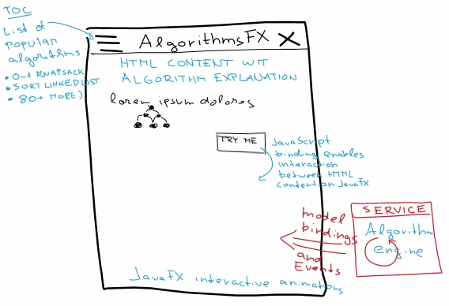

    
    
    
    

# AlgorithmsFX
The goal of this project is to demonstrate the solution of popular algorithms using animated graphics in JavaFX.

## Concept
The project is currently in its initial stages. But the concept is as follows.
* JavaFX desktop client will contain two panels.
    * The top panel for static HTML content will contain an explanation of the discussed topic. The HTML content will be loaded from an external server using a URL request.
    * The bottom panel will contain an interactive animation of the calculation progress.
* I will use reactive streams ([RxJava](https://github.com/ReactiveX/RxJava) or alternative) for an event driven communication between the service and the JavaFX model.
* I will use JavaScript bridging library from [org.netbeans.html](http://bits.netbeans.org/html+java/dev/) to enable an interaction between HTML content and JavaFX

## UI proposal

